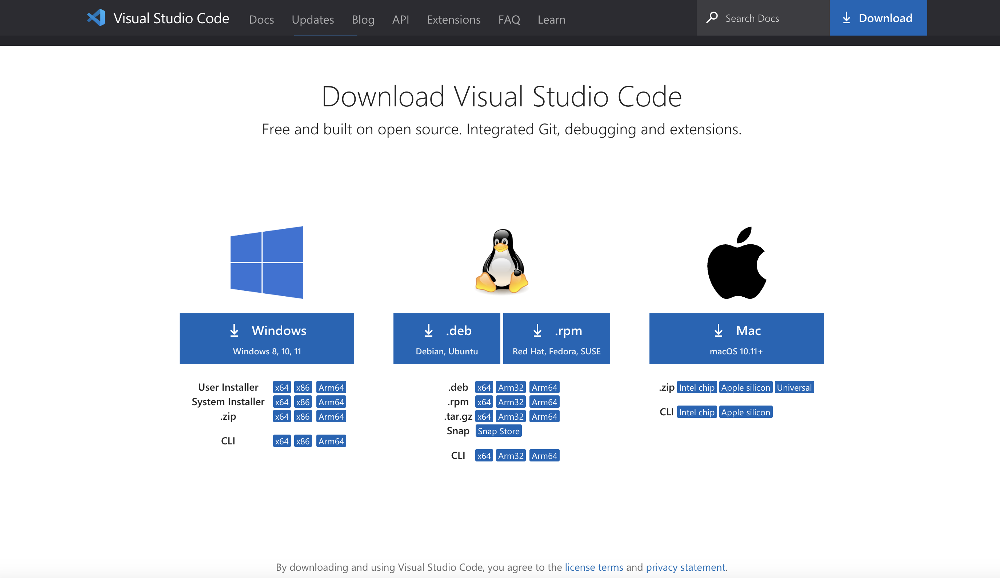
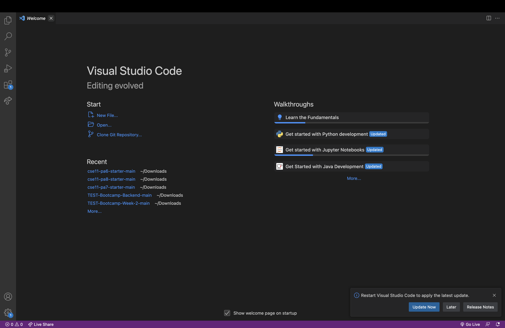
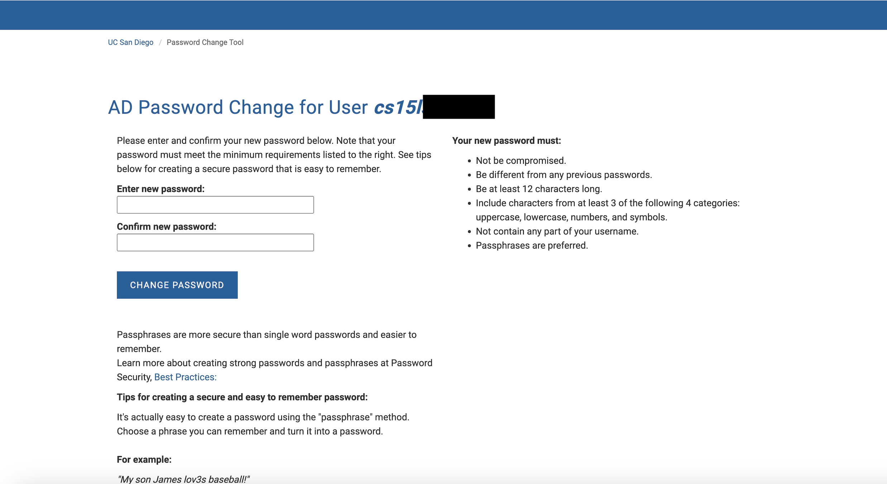
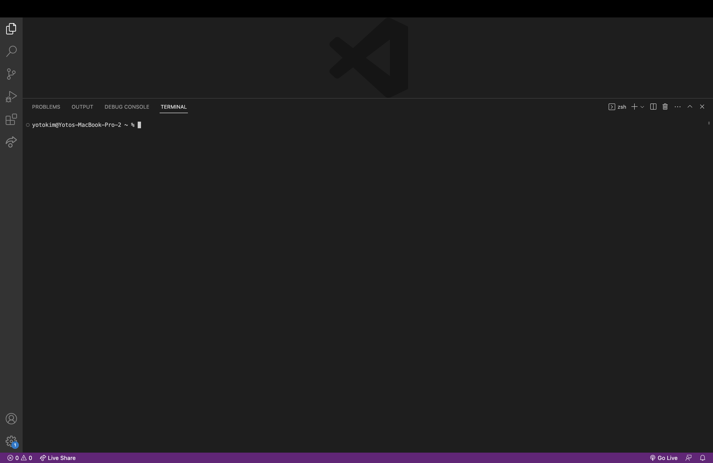
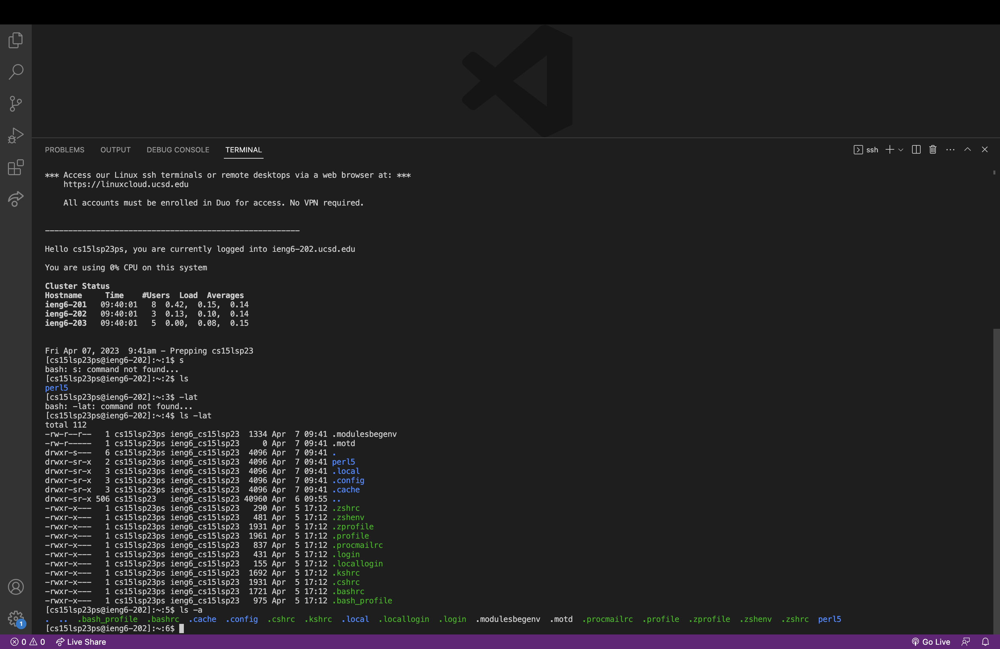

# Lab Report 1
## Part 1 - Installing VScode:
Hello CSE15L students! I’m going to show you all how to log into a course-specific account on ieng6. First, we’re going to install Visual Studio Code (VSCode), a widely-used code editor. Visit the Visual Studio Code website at https://code.visualstudio.com/ and follow the instructions on the page to download and install VSCode on your computer. 

When you click download in the top right, it should give you different options to install VSCode on your computer. Make sure you select the version that is compatible with your computer!
 
Once you download VSCode successfully, you should see a screen like this or something similar (when you first download VSCode, it may give you a welcome page that asks you to specify certain settings)

## Part 2 - Remotely Connecting

Step 1: Go to this site: https://sdacs.ucsd.edu/~icc/index.php and look up your account using your UCSD username and student ID. Once you log in, under “Additional Accounts”, you should see a button that says cs15l(the quarter you are taking this class)(two letters). Ex: cs15lsp23zz

Step 2: Click the button with your cs15l username, then click the link to change your password toward the top (Global Password Change Tool). Then, go to "Proceed to the Password Change tool" under Student Accounts. Where it asks for your username, type in your cs15l student username from before (Ex: cs15lsp23zz). This will then eventually take you to the password change screen (below) after confirming on Duo and confirming the password rest on your email. Change your password to something you'll remember! The password change may take some time to be updated in the system.

Step 3: Now that we have our account, we can remotely connect! If you are on Windows, you must first download Git first. Open VSCode and open the terminal (ctrl or command + ~ or by using Terminal -> New Terminal). Your terminal should look like something below:

Step 4: On your terminal, type the command below, where the "cs15lsp23zz" is replaced by your unique course-specific username from Step 1 and 2. 

**$ ssh cs15lsp23zz@ieng6.ucsd.edu**

The dollar sign should not be typed in!

Step 5: When it asks if you are sure you want to be connecting, type "yes" and it will ask for your password. Type in your password from Step 2 (note that the terminal will not show that you are typing anything) and you will be logged in! You are now remotely connected to a computer in the CSE Basement!

## Part 3 - Running Commands

Now that we're logged in, let's run some commands! Here are some easy commands you can try: **cd~**, **cd**, **ls -lat**, or **ls -a** You can just type them in to the terminal and hit enter to run them! Below, I've tried the "ls -lat" and "ls -a" commands.

To log out, you can either use "ctrl + d" or run the command "exit".

