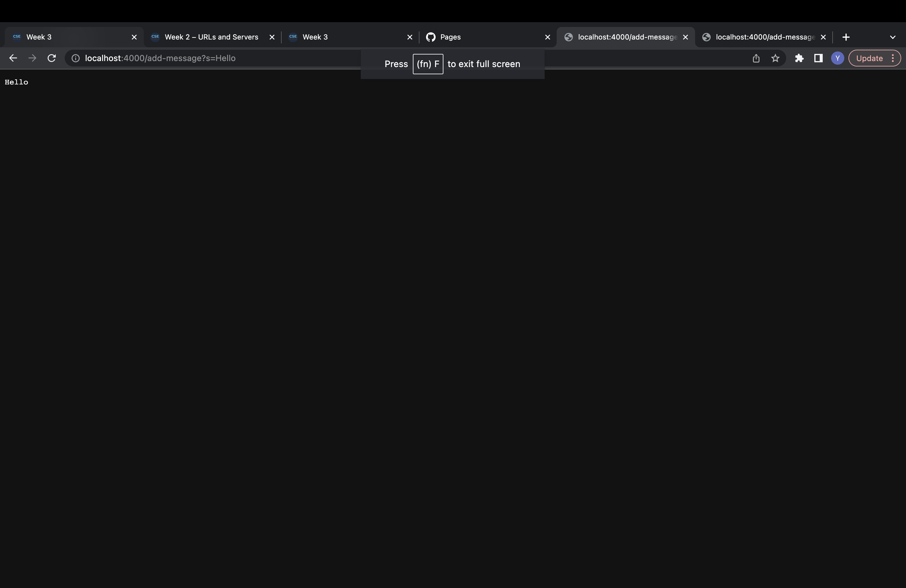
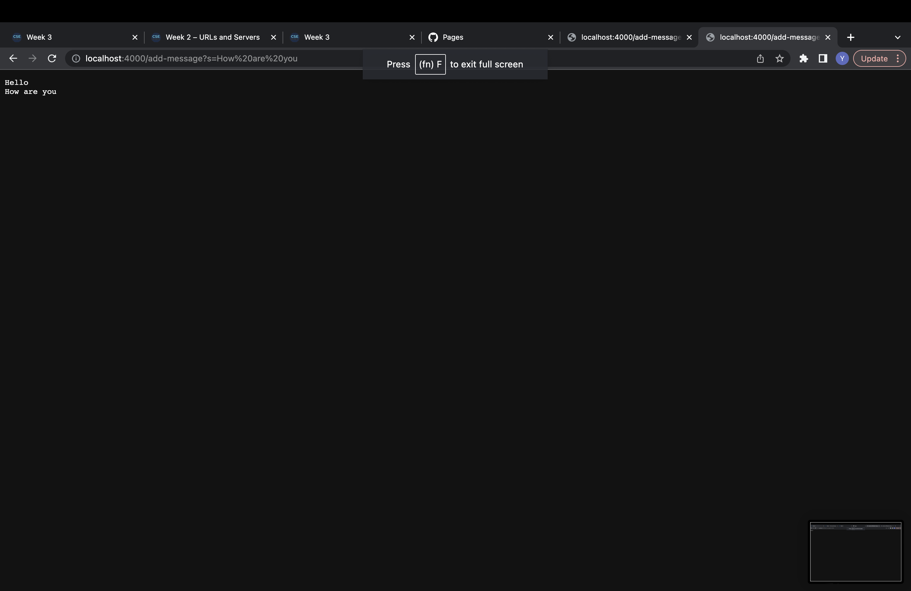
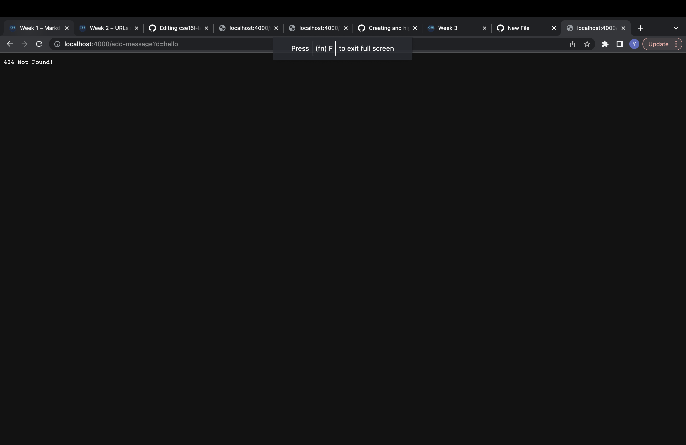

# Lab Report 2
## Part 1 - Web Server

**Code**
```
import java.io.IOException;
import java.net.URI;

class Handler implements URLHandler {

    String lst = "";
    int count = 0;

    public String handleRequest(URI url) {
        if (url.getPath().equals("/")) {
            return lst;
        }
        else {
            System.out.println("Path: " + url.getPath());
            if (url.getPath().contains("/add-message")) {
                String[] parameters = url.getQuery().split("=");
                if (parameters[0].equals("s")){
                    if (count == 0){ //I use count to make sure that the very first line does not start with "\n" and leave a blank line before printing the first message
                        lst += parameters[1];
                        count += 1;
                    }
                    else if (count == 1){
                        lst += "\n" + parameters[1];
                    }
                    return lst;
                }   
            }
            return "404 Not Found!";
        }
    }
}


 class StringServer {
  
    public static void main(String[] args) throws IOException {
        if(args.length == 0){
            System.out.println("Missing port number! Try any number between 1024 to 49151");
            return;
        }

        int port = Integer.parseInt(args[0]);

        Server.start(port, new Handler());
    }
}
```

**Screenshot 1: Normal Functionality**

There are many methods called, I am going to walk through them, mentioning what arguments/fields are involved. First, there are two field values, lst and count. The "handleRequest" method is called with the url
as the argument. In this method, we are basically kind of breaking apart the URL and seeing what is going to be added to the server. Inside handleRequest, the url.getPath() method is called with no argument. 
This method gets the decoded path of the url (what we see in the url line). Then, ".contains" is called on this path with an argument of "/add-message". This method checks if the url has "/add-message" in it, which it does for this screenshot.
After that, the "getQuery()" method and the ".split()" method is called onto the url. The getQuery method has no argument and is called on the url to retrieve the query component of the url. Then, the .split method is called with "=" as an argument to split the "s" from the actual message, creating an array.
Then, we check if the first element of this array is "s", which it is, and check if the count is 0. In this screenshot, "Hello" is the very first message, so the count is 0. (I did this so that the very first line does not start with a blank line ("\n") before printing the first message.) The field value lst gets updated to add the string "Hello" and count gets incremented by 1.
  
If we were to want to add a string "How are you", everything above will run, EXCEPT since count is 1 now, count does not get incremented and lst gets added by the new message on a new line. See below screenshot



**Screenshot 2: Mistake!**

In this screenshot, I "accidentally" put "d=hello" instead of "s=hello" in the url. The handleRequest method still runs with the url as the argument and the.getPath(), .contains(), .getQuery(), and .split() methods run similar to what was described in the Screenshot 1 description. However, because we inputted "d" and not "s", the if statement will not run and instead, we will return a "404 Not Found" message. Neither the lst nor the count field values get updated.


## Part 2 - Bug


**Failure Inducing Input**
``
  @Test
  public void testReverseInPlaceNoWork(){
    int[] i = {50, 51, 52};
    ArrayExamples.reverseInPlace(i);
    assertArrayEquals(new int[]{52, 51, 50}, i);
  }
``

**Input that doesn't induce Failure**
``
@Test 
public void testReverseInPlace() {
    int[] input1 = { 3 };
    ArrayExamples.reverseInPlace(input1);
    assertArrayEquals(new int[]{ 3 }, input1);
	}
``

**Symptom**

**Before**
``
  static void reverseInPlace(int[] arr) {
    for(int i = 0; i < arr.length; i += 1) {
      arr[i] = arr[arr.length - i - 1];
    }
  }
``


**After**
``
  static void reverseInPlace(int[] arr) {
    int[] copy = new int[arr.length];
    for (int i=0; i<arr.length; i++){
      copy[i] = arr[i];
    }
    for(int i = 0; i < arr.length; i += 1) {
      arr[i] = copy[arr.length - i - 1];
    }
  }
``

The symptom was that the first half of the array would be reversed, but the second would not. This is because the original code would update the first half to be reversed, then try to update the second half by using these updated values of the first half. To fix this issue, my code creates a copy of the array. Each element of the array would just be updated with their respective reversed element in the copy array. This way, we can just update our original array with the elements of the copy array without having to worry about the copy array being changed or the original array being updated wrong.


## Part 3 - Reflection

Something I learned in Week 2 was how to run servers and how to read/interpret urls intricately. Before, I never paid too much attention to urls, so it was interesting to learn about the different components and what each of them dictate as well as how we can access/use urls in our code. Additionally, running servers and updating them was super interesting as well; in most of my coding classes, there aren't too many ways to see my code work in a way that goes beyond VSCode/Eclipse, so I was intrigued to learn about running servers.
