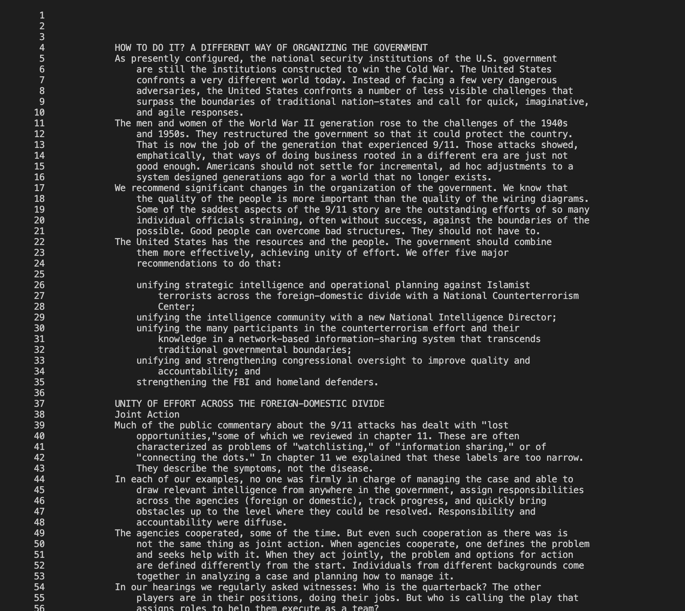
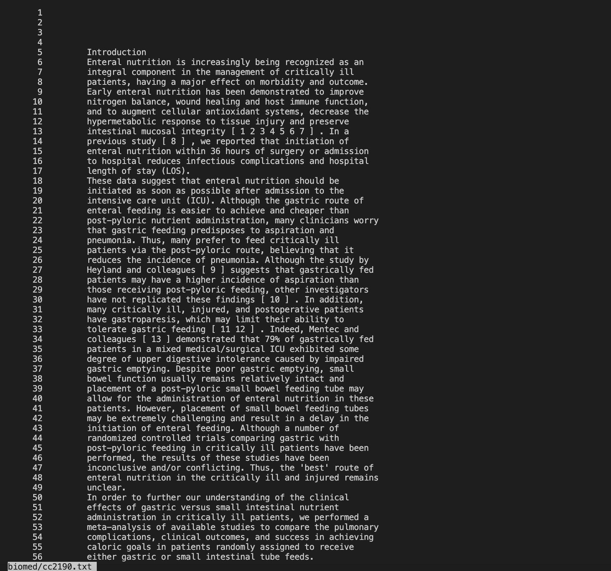
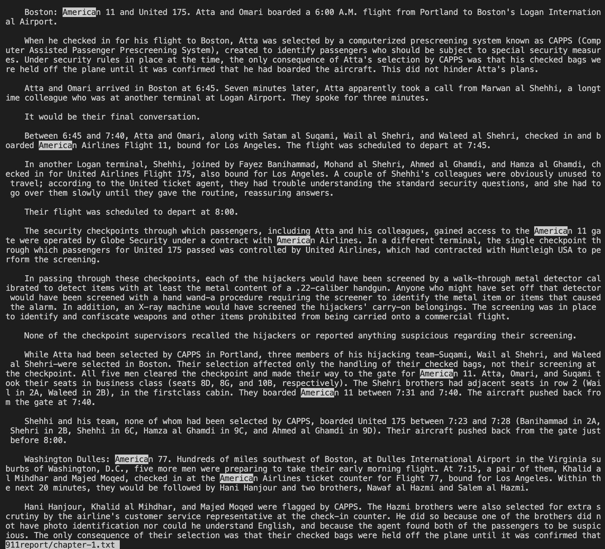
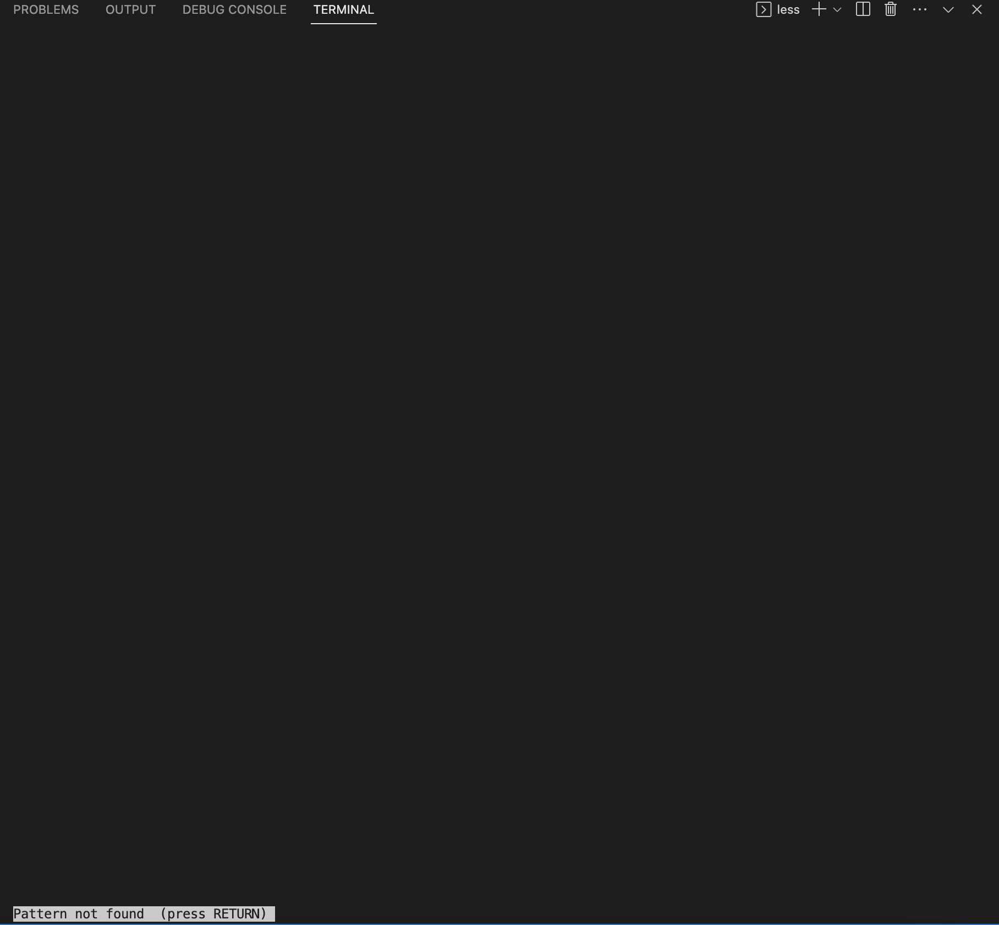
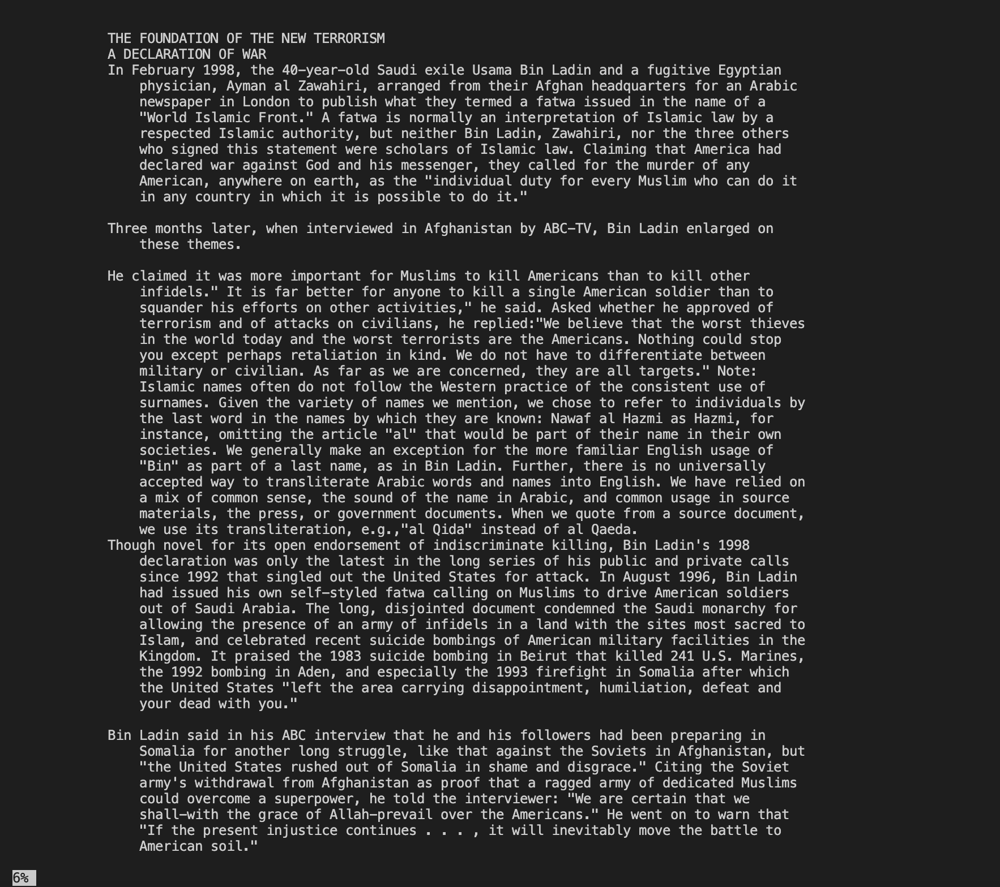
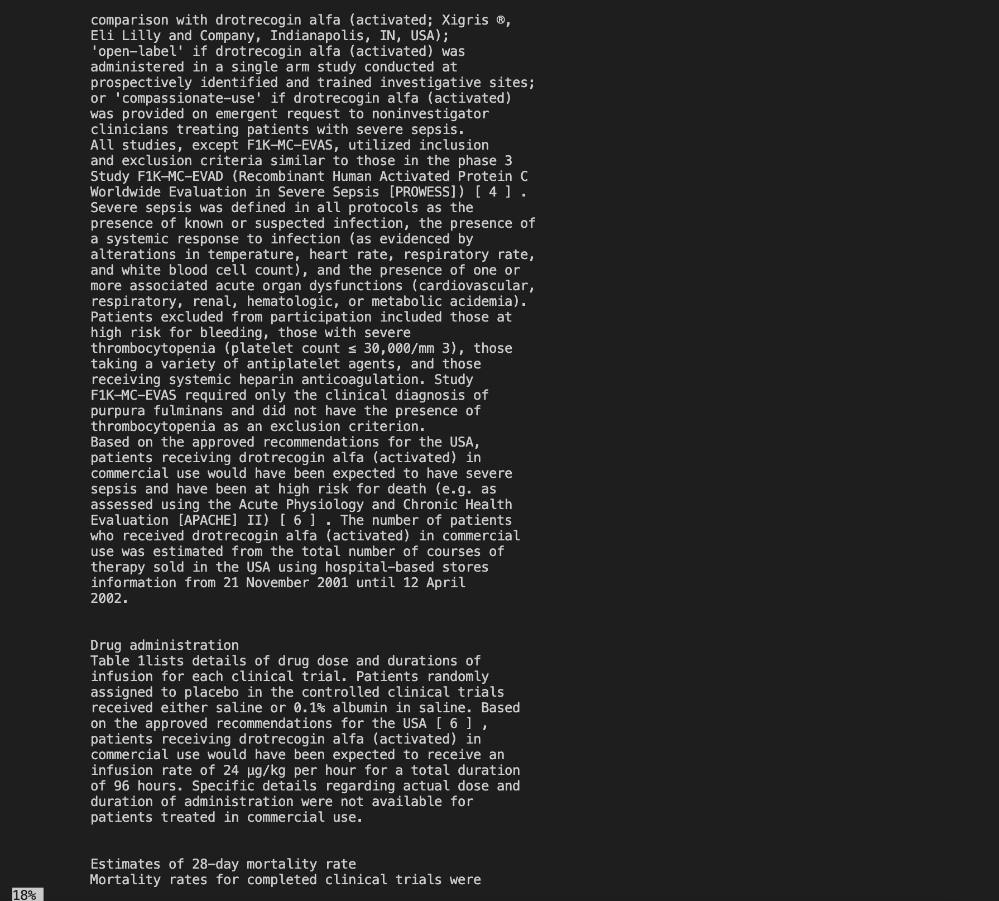

# Lab Report 3

Note: I used Screenshots to display most of my outputs because the function of the command-lines are better displayed through the screenshot images rather than code blocks.

**Command 1, Example 1**

Command:
`less -N 911report/chapter-13.1.txt` 

Output:

I ran the command and the above outputted. The `-N` displayed the line numbers for the contents in the `911report/chapter-13.1.txt file`. Below the second example, I talk more about this functionality and its usefulness.

**Command 1, Example 2**

Command:
`less -N biomed/cc2190.txt `

Output:

I ran the command and the above outputted. Again, like the first example, tje `-N` displayed the line numbers for the contents in the `biomed/cc2190.txt` file.

The command line option with `-N` displays line numbers for the contents of a file. This can be useful in many ways. First, it can allow you to reference specific line numbers in the file, making it easier to identify, locate, and look at the information you want. It can also allow you to navigate the file much faster and easier, especially for large files, since you can look up and read a specific line in a file.

Source: https://linuxize.com/post/less-command-in-linux/

---

**Command 2, Example 1**

Command:
`less -X 911report/chapter-12.txt`

Output:

In the above code, I ran `less` with  `-X` on the `911/report/chapter-12.txt` file. As usual, it printed out the contents of the file, one page at a time like the usual function of just `less`. But with the `-X`, it actually leaves the file contents on the screen even when you exist `less`. Below the second example, I wrote about why the command is useful.

**Command 2, Example 2**

Command:
`less -X biomed/rr74.txt` 

Output:

    
In this second example, `less` with  `-X` was used on the `biomed/rr74.txt` file, printing out the first page of the file contents and leaving the file contents on the screen after exiting `less`.When using `less`, the file contents are usually cleared from the screen. However, the `-X` option allows the contents to leave the contents on screen. In the example above, it prints out the contents of the `biomed/rr74.txt` file and leaves it there. This is useful as the file may have important information that you want to refer to or view easily later. It can also help you keep track of which file you were viewing at which time since the file contents will remain even after you exist `less`.

Source: https://linuxize.com/post/less-command-in-linux/

---

**Command 3, Example 1**
`less -pAmerica 911report/chapter-1.txt`

Output:

I ran the command and the above was the output. Because I ran the command with `-pAmerica`, it searched through and highlighted all of the contents in the `911report/chapter-1.txt` file with America in it.

**Command 3, Example 2**
`less -pRNA biomed/cc2172.txt`

Output:

I ran the command and the above was the output. I ran the command with `-pRNA`, but because `RNA` is not anywhere in the contents of the file `biomed/cc2172.txt`, the output displays that the pattern was not found.

The `-p` option in `less` specifies a pattern to search for in the file.  `less` will position its display at the first occurence of the given pattern. If the pattern is nowhere in the file, it will return that the pattern could not be found. This is very useful as it allows one to easily search for and identify a file for a specific patterns of interest. When editing or reviewing files, `-p` can easily help you locate the lines that you would like to look at. It can also save you a lot of time as you can use it to see if a file has a pattern of interest to you and if it does not, `less` will tell you and you can move on.

Source: https://phoenixnap.com/kb/less-command-in-linux

---

**Command 4, Example 1**
Command: `less -m 911report/chapter-2.txt`

Output:

I ran the command and the above outputted. It prints out the same way a normal `less` command would print out the file contents, but in the bottom left there is a percentage. As one scrolls through the file, this percentage increases, recording how much of the content you have viewed. 

**Command 4, Example 2**
Command: `less -m biomed/cc2167.txt`

Output:

Like the first example, it prints out the same way a normal `less` command would print out the file contents, but in the bottom left there is a percentage. In this example, I scrolled down a little more to show that the percentage does increase as you scroll down more and thus view more of the file content.

The `-m` command option for `less` dislays the percentage of the file that has been viewed. It is very useful as it can help you track your progress as you review a file. For example, for a large file, you may need to do another task or want to take a break in the middle of reviewing the file, and having a percentage track record allows you to easily come back to your task. It can also increase efficiency and time management since you can see how much of the file you have viewed and how much is left.

Source: https://phoenixnap.com/kb/less-command-in-linux
