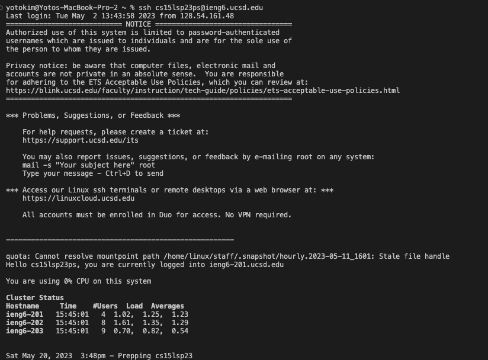
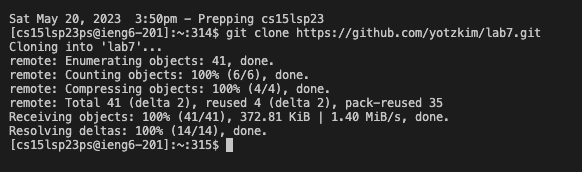
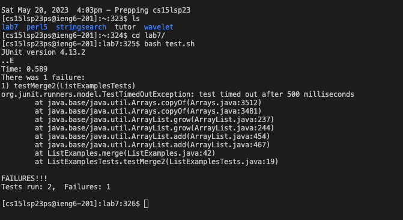
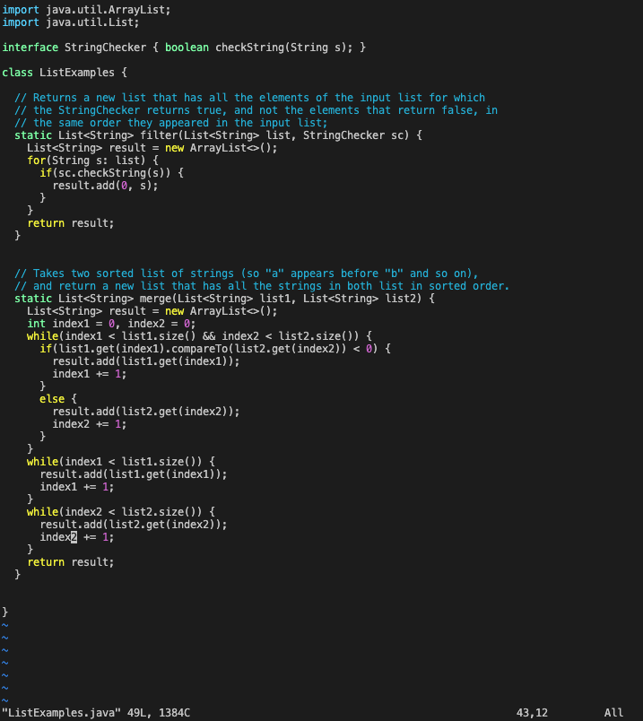
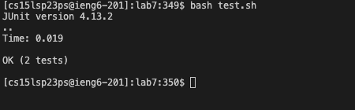
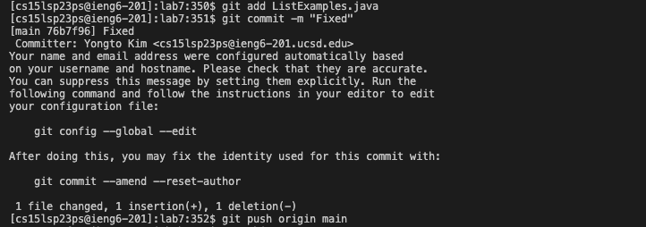

# Lab Report 4

**Step 4**

Keys pressed: all the characters used to type the command `ssh cs15lsp23ps@ieng6.ucsd.edu`, then `<enter>`. 

This allows me to log into ieng6.
  
---
  
**Step 5**

  Keys pressed: Went to the Github repository and copied the link to the fork of the repository using mouse clicks. All the characters used to type the command `git clone`, `command+v` to paste the link, `<enter>`. 
  
  I wanted to clone the repository and copy paste the repository link easily so I used `command+v`.
  
 ---
  
  **Step 6**

   Keys pressed: `ls`, `<enter>`, `cd`,`<space>`, `l`, `<tab>`, `<enter>`, `bash`, `<space>`, `t`, `<tab>`, `<enter>`. 
    
I first used `ls` to check what directory I was in, then used `cd` to enter the `lab7` directory. I know that `lab7` is the only directory in my ieng6 that starts with `l` so I used `<tab>` to autofill the diirectory name. I then used `bash` to run the tests and since I know `test.sh` is the only bash script in the directory, I typed `t` and used `<tab>` to autofill.
    
---
**Step 7**

  Keys pressed: `vim`, `<space>`, `Li`, `<tab>`, `.`, `<tab>`, `<enter>`, `/index1`, `<enter>`, `n`, `n`, `n`, `n`, `n`, `n`, `n`, `n`, `l`, `l`, `l`, `l`, `l`, `r`, `2`, `:wq`, `<enter>`. 
  
  I wanted to open `vim` to edit the `ListExamples.java` file. So, I used `vim` and used `Li` and `<tab>` to autofill to the name `ListExamples`, then used `.` and `<tab>` to autofill to `ListExamples.java`. I used `/index1` to search for all instances of `index1`. I went through each instance of `index1` using `n` until I found the instance of `index1` with the error. I ised `l` five times to move 5 characters to the right so that my cursor hovered over the `1` in `index1`. I used `r` to tell vim that I want to replace this specific character and typed `2` to be the character to replace `1`. I then typed `:wq` and `<enter>` to save the changes.
  
 ---
 **Step 8**
 
 
 
 Keys pressed: `<up>`, `<up>`, `<enter>`. 
 The `bash test.sh` command was two up in the command line history (from Step 6), so I used arrows to access it.
 
 ---
 **Step 9**
 
 
 
 Keys pressed: `git`, `<space>`, `add`, `<space>`, `Li`, `<tab>`, `.java`, `<enter>`, `git`, `<space>`, `com`, `<tab>`, `-m`, `<space>`, `"Fixed"`, `<enter>`, `git`, `<space>`, `push`, `<space>`, `<tab>`, `m`, `<tab>`, `<enter>`
 
 I used the `git add` command to add the changes to the `ListExampples.java` file. Again, I used `Li` then `<tab>` to autofill to `ListExamples` then manually typed `.java`. I then used `git commit -m` with a message of `"Fixed"` to commit these changes. I used `com` and then `<tab>` to autofill `com` to `commit`. I then typed `git push` then used `<tab>` to autofill to `origin`, then typed `m` and `<tab>` to autofill to main.
