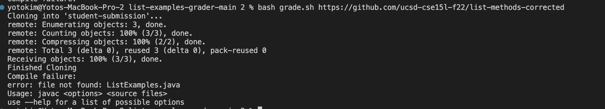
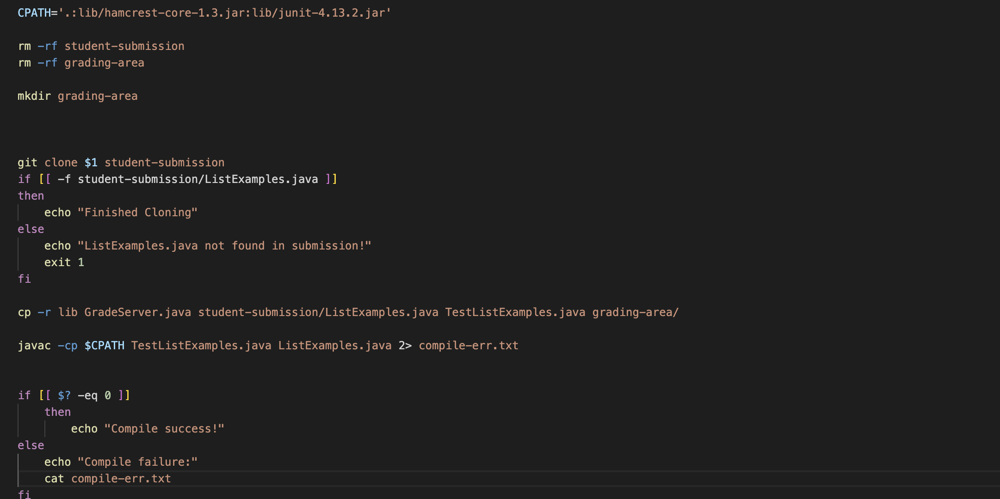

**What environment are you using (computer, operating system, web browser, terminal/editor, and so on)?**
I am working on a MacBook (macOS Ventura 13.2.1) and VSCode. 

**Detail the symptom you're seeing. Be specific; include both what you're seeing and what you expected to see instead. Screenshots are great, copy-pasted terminal output is also great. Avoid saying “it doesn't work”.**
I expected the file to compile correctly and give me the "Compile Success" message as well. Here is the bug in the command line:

**Detail the failure-inducing input and context. That might mean any or all of the command you're running, a test case, command-line arguments, working directory, even the last few commands you ran. Do your best to provide as much context as you can.**
It gives me the error that `ListExamples.java` could not be found. That's weird because I know we just created and copied it and since `ListExamples.java` was the second argument to compile, it means that the first argument, `TestListExamples`, was fine. Why is that the case? My code is shown below:

---
TA Response:
Thanks for the detailed question! Remember that when you created and copied the files, they were put into the `grading-area` folder. This means, that to access these files, you would need to specify the file path to access `grading-area` then access the two files. The reason why `TestListExamples` was ok to compile was because this file existed already outside of the `grading-area` folder. Hope this helps!

---

Thank you so much! I see it now! My bug was that in line 21 when I compile the files, I did not specify the correct path to first look into `grading-area` to access the files.

---

SetUp:
- Use the examples-grader file from Week 6. Your working directory should just be `list-examples-grader`.
- The contents of each of the file is exactly the same as when you first download the `example-grader` file EXCEPT `grade.sh` should look like below:

- The command line to trigger the bug is `bash grade.sh https://github.com/ucsd-cse15l-f22/list-methods-corrected`.
- What fixed the bug was adding the correct file path to the line of code that compiles the two files `TestListExamples.java` and `ListExamples.java`. These fixes are shown above to the student's response to the TA's answer
